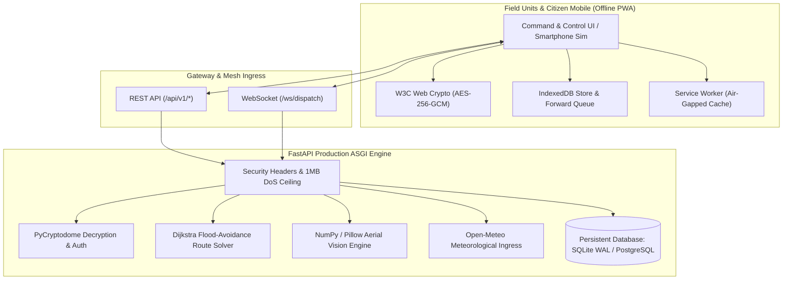

# ⚡ AapdaSetu (AEGIS-MESH)
### Resilient Disaster Evacuation, Command Dispatch & Offline Mesh Platform

[](https://github.com/)
[](https://fastapi.tiangolo.com/)
[](https://www.sqlite.org/)
[](https://developer.mozilla.org/en-US/docs/Web/API/SubtleCrypto)
[](https://en.wikipedia.org/wiki/Dijkstra%27s_algorithm)
[](https://web.dev/progressive-web-apps/)

**AapdaSetu** is an enterprise-grade, offline-resilient disaster dispatch and evacuation platform built to maintain life-saving coordination during catastrophic grid failures, severe urban floods, and telecommunication blackouts.

---

## 🏛️ System Architecture



---

## 🌟 Production Capabilities

### 1. 🗺️ Dynamic GIS & Dijkstra Evacuation Routing
- **Real-Time Road Network (`/api/v1/routing/network`)**: Graph model representing bridges, viaducts, intersections, shelters, and trauma centers.
- **Dijkstra Flood Avoidance (`/api/v1/routing/calculate`)**: Dynamically penalizes or assigns infinite impedance to submerged corridors (`flood_depth >= threshold`), calculating safe detours for ambulances and rescue boats with safety clearance margins.
- **Live Corridor Rendering**: Displays operational corridors in emerald green and impassable flood hazards in dashed red on an interactive Leaflet map.

### 2. 🔐 Authentic AES-256-GCM Cryptographic Pipeline
- **Browser-Side W3C Web Crypto**: Generates cryptographically secure 12-byte IVs (`crypto.getRandomValues`) and authenticates telemetry with AES-GCM (128-bit tag).
- **Backend AEAD Decryption**: Decrypts and verifies signatures via Python's `cryptography` module before persisting to the database, preventing forged or tampered distress beacons.

### 3. 💾 High-Concurrency Persistent Storage
- **SQLAlchemy ORM + SQLite WAL Mode**: Configured with `PRAGMA journal_mode=WAL`, `PRAGMA synchronous=NORMAL`, and busy timeouts to support high-throughput concurrent distress submissions without table locking.
- **Collision-Free UUID Keys**: Generates unique, non-overlapping incident identifiers under burst traffic.

### 4. 📴 100% Offline Air-Gapped Disaster Readiness
- **Local Vendor Bundles (`/src/vendor/`)**: Pre-packaged, minified bundles of Leaflet GIS, Lucide icons, Chart.js, and Tailwind with CDN fallback. Operates with zero internet connectivity when deployed on a field laptop or Raspberry Pi.
- **Store-and-Forward (IndexedDB)**: Caches outgoing SOS distress packets during radio silence, automatically flushing them to the dispatch gateway upon network reconnection.
- **Cache-First Service Worker (`sw.js`)**: Instantly loads the application shell during severe connectivity disruptions.

### 5. 🛰️ Live Hydrological & Meteorological Ingress
- **Open-Meteo API**: Automatically polls real-time precipitation, wind velocity, and dam discharge telemetry, calculating catchment runoff and flood breach probabilities.

### 6. 👁️ Aerial Vision & Spectral Water Analysis
- **Pillow & NumPy Pipeline**: Decodes drone and aerial reconnaissance frames, computes water-band spectral ratios to calculate surface flood coverage percentages, and isolates stranded survivors with scaled bounding coordinates.

---

## ⚡ Quick Start

### Prerequisites
- Python 3.10+ (Recommended: Python 3.13)
- Git

### 1. Local Setup (Virtual Environment)
```powershell
# Clone the repository
git clone https://github.com/kamilahmadhashmi/APDAsetu.git
cd APDAsetu

# Create and activate virtual environment
python -m venv .venv
.\.venv\Scripts\Activate.ps1   # Windows PowerShell
# source .venv/bin/activate    # Linux / macOS

# Install dependencies
pip install -r requirements.txt
```

### 2. Dual-Mode Local Execution (Real Data vs Simulated Data)

AapdaSetu supports running **TWO completely separate local instances** concurrently or independently:

| Instance | Mode | Frontend URL | Backend API | Database | Data Sources |
|---|---|---|---|---|---|
| **Instance 1** | **REAL DATA** | `http://localhost:3000` | `http://127.0.0.1:5000` | `backend/aegis_real.db` | Open-Meteo High-Resolution Live Stream, OpenStreetMap Overpass API, GDACS RSS/CAP Feed |
| **Instance 2** | **SIMULATED DATA** | `http://localhost:3001` | `http://127.0.0.1:5001` | `backend/aegis_simulated.db` | Deterministic Mock Scenarios, Pre-seeded Hospitals/Fleet, Synthetic Dijkstra Flood Graph |

#### Option A: Run Both Instances Concurrently (Recommended)
```bash
npm run dev:both
# or via Python launcher:
.\.venv\Scripts\python run.py --mode both
```
- Open **Real Data Mode**: [http://localhost:3000](http://localhost:3000) (Header shows green `● LIVE DATA` badge)
- Open **Simulated Data Mode**: [http://localhost:3001](http://localhost:3001) (Header shows purple `● SIMULATION MODE` badge)

#### Option B: Run Only Instance 1 (Real Data Mode)
```bash
npm run dev:real
# or via Python launcher:
.\.venv\Scripts\python run.py --mode real
```

#### Option C: Run Only Instance 2 (Simulated Data Mode)
```bash
npm run dev:simulated
# or via Python launcher:
.\.venv\Scripts\python run.py --mode simulated
```

---

## 🐳 Docker Deployment

Deploy with a single command on any cloud host, field laptop, or edge device:

```bash
docker compose up -d --build
```

The container includes:
- Non-root runtime user (`appuser:1000`)
- Built-in container health check (`/api/v1/system/health`)
- Named persistent volume mount (`aapda_data`) for the database

---

## 📡 API Reference Overview

| Method | Endpoint | Description |
|---|---|---|
| `GET` | `/` | Serves the full Command & Control application shell |
| `GET` | `/simulation` | Serves the interactive Smartphone Simulator |
| `GET` | `/api/v1/system/health` | Operational health and latency telemetry |
| `GET` | `/api/v1/incidents` | Query active persistent distress incidents |
| `POST` | `/api/v1/incidents/ingest` | Ingest and verify AES-256-GCM distress packets |
| `GET` | `/api/v1/hospitals` | Hospital bed occupancy and trauma capacity |
| `GET` | `/api/v1/fleet` | Rescue boat, helicopter, and pumper truck telemetry |
| `GET` | `/api/v1/roads` | Real-time road hazard and flood depth monitoring |
| `GET` | `/api/v1/routing/network` | Full topological road network with clearance thresholds |
| `POST` | `/api/v1/routing/calculate` | Dijkstra path solver with live hazard avoidance |
| `POST` | `/api/v1/routing/solver` | Multi-objective fleet and hospital allocation solver |
| `POST` | `/api/v1/vision/analyze` | Aerial drone image analysis & victim localization |
| `GET` | `/api/v1/weather/live` | Live Open-Meteo precipitation and water level stream |
| `WS` | `/ws/dispatch` | Real-time bidirectional WebSocket event stream |

---

## 🛡️ Security Audit & Hardening Remediations

| Vulnerability ID | Classification | Remediation Applied |
|---|---|---|
| **SEC-01** | Process Crash via Malformed URI | Wrapped `decodeURI` in `serve.js` inside `try...catch` returning HTTP 400 Bad Request. |
| **SEC-02** | Denial of Service / Memory Exhaustion | Enforced 1MB payload ceiling across `server.py`, `backend/main.py`, and `api/index.py`. |
| **SEC-03** | Stored DOM Cross-Site Scripting (XSS) | Implemented `escapeHtml()` sanitization across all Leaflet popups and sidebar innerHTML interpolations. |
| **SEC-04** | Cryptographic Mockup Bypass | Implemented authentic W3C Web Crypto + PyCryptodome AES-256-GCM AEAD encryption pipeline. |
| **SEC-05** | Missing Defensive HTTP Headers | Enforced `X-Content-Type-Options: nosniff` and `X-Frame-Options: SAMEORIGIN` / `DENY`. |
| **SEC-06** | Directory Traversal | Normalized path resolution and enforced strict directory boundary checks. |

---

## 🧪 Running the Verification Test Suites

```powershell
# Run the full dual-mode provider and backend unit test suite
.\.venv\Scripts\pytest backend/test_backend.py backend/test_providers.py -v
# or:
npm test

# Run server hardening and crash resilience verification tests
.\.venv\Scripts\python backend/test_servers.py

# Run end-to-end concurrent dual-instance live test
.\.venv\Scripts\python backend/test_dual_mode_e2e.py
```

---

## 📄 License
This project is open-sourced under the MIT License.
